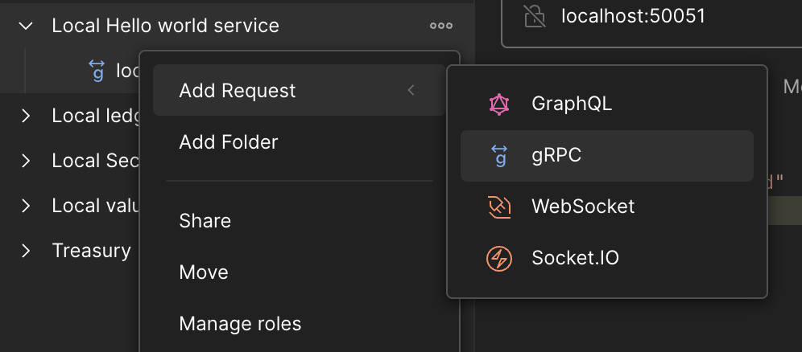
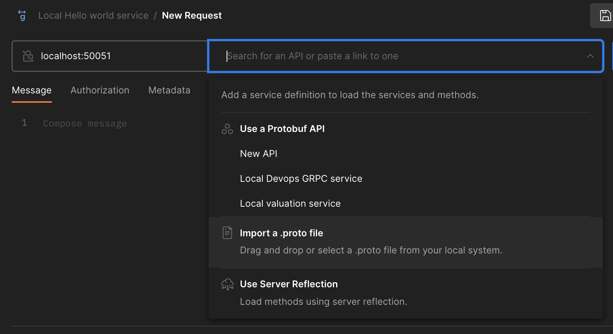
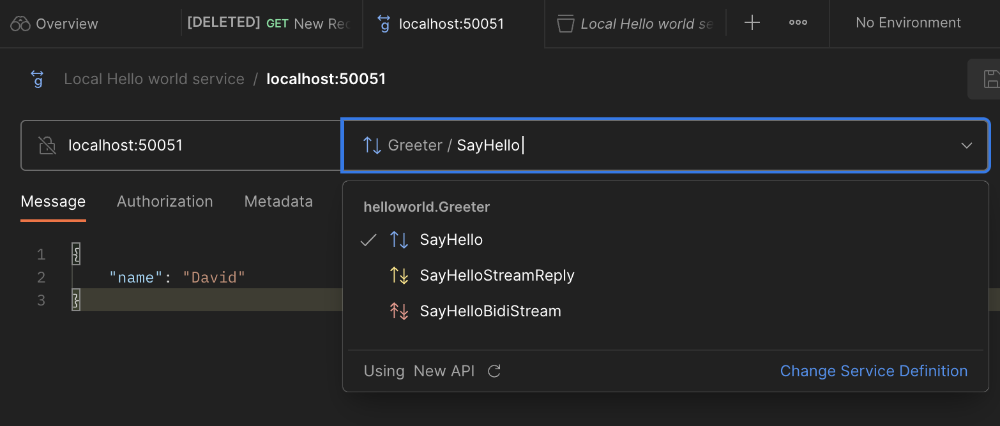

# Steps

## Install dependencies and compile code

Run: 

`./compile.sh`

This will generate some python files called compile_*.py:

compiled_helloworld_pb2.py - The proto contents copmiled into Python. Note: it uses a lot of auto-wiring code so is not very readable
compiled_helloworld_pb2.pyi - An interface file that provides help understanding the compiled output
compiled_helloworld_pb2_grpc.py - A stubbed version of the GRPC service that can be imported and implemented

## Run Server

`python3 handcoded_server.py`

This code is handcoded (hence the name). Notice that the server extends the GRPC compiled definition called Greeter Servicer:


```
class Greeter(compiled_helloworld_pb2_grpc.GreeterServicer):
    def SayHello(self, request, context):
        return compiled_helloworld_pb2.HelloReply(message="Hello, %s!" % request.name)
```

The greeter service implements all the methods and throws an error saying unimplemented. So the handcoded version simply overrides this and implements a behavior. 

The other service endpoints could be called but will claim of being unimplemented.

Also note the wiring code:

`compiled_helloworld_pb2_grpc.add_GreeterServicer_to_server(Greeter(), server)`

If you click through to the add_GreeterServicer_to_server definition. You can see it calls the compiled code which simply defines the stream handlers which explains to GRPC how to interpret protos it receives, then calls a generic function at the bottom to wire it up into the server:

`
    generic_handler = grpc.method_handlers_generic_handler(
            'helloworld.Greeter', rpc_method_handlers)
    server.add_generic_rpc_handlers((generic_handler,))
`

## Run Client

Run 

`python3 handcoded_client.py`

Constructs a proto and sends it to the server

## Using Postman

Import the API into Postman using this (see steps below for step-by-step)

https://martian-resonance-121183.postman.co/workspace/Fintekkers~77780f3f-bf5e-4f53-b27a-cff849e438c5/collection/63a770f605b4516caf7f0216?action=share&creator=25066831

Create a new GRPC request:



Enter the server address into the server section. The example doesn't have server reflection enabled. So you have to import the proto definition (protos/compiled_helloworld.proto):



Postman will load the proto definition and know what the server looks like:




You can enter the data into Message section, select the SayHello method and then call it.
